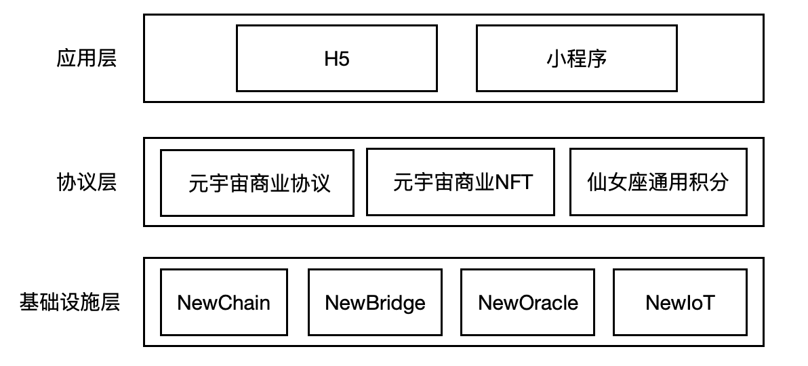
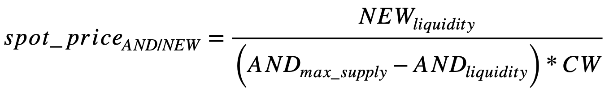
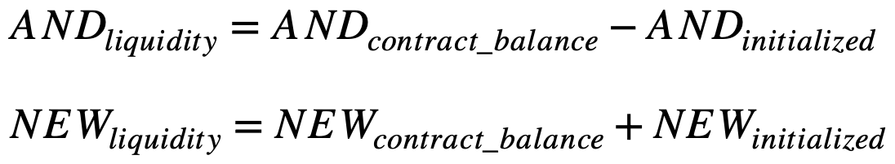
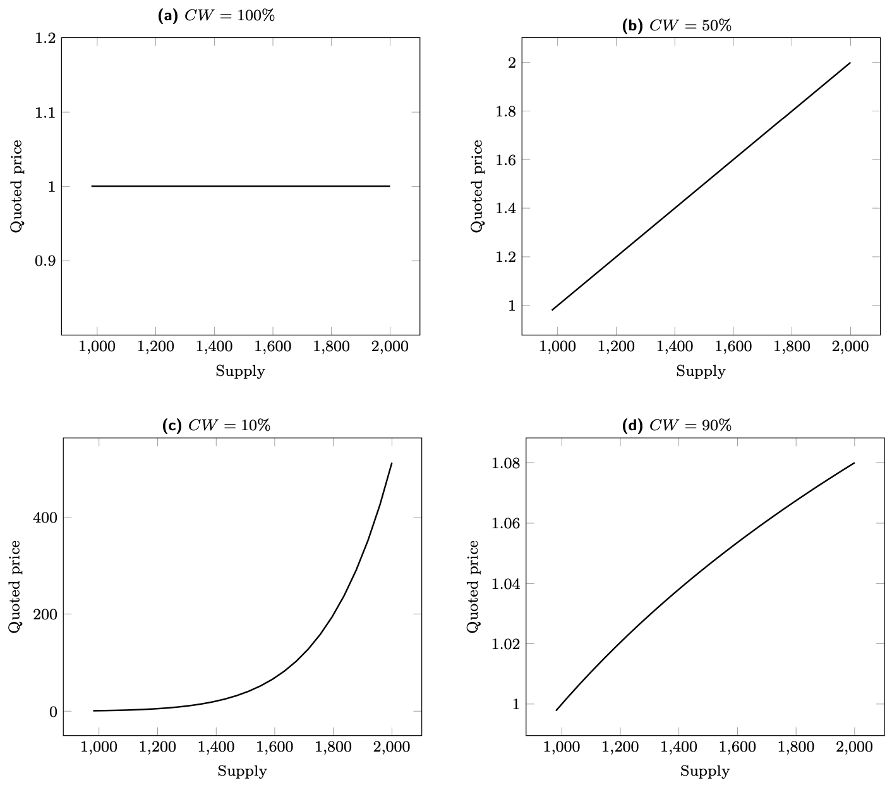
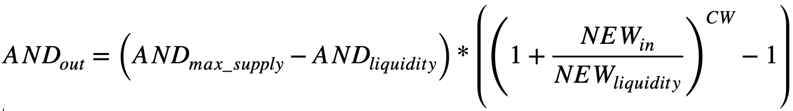
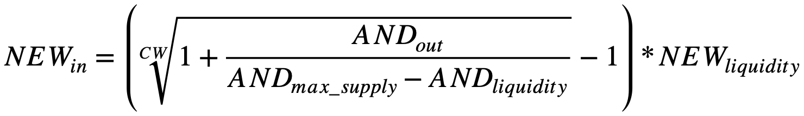

The Andromeda Metaverse Commerce Ecology constructs a rich and fascinating economic system by creatively combining dual pass-throughs (AND and AT) and the hybrid design of the Metaverse Commerce NFT. Among them, AND, as the governance token of Andromeda Metaverse, is pledge mined using PoS model; AT, as Andromeda Universal Credits, is behaviorally mined using PoA model; and Metaverse Commerce NFT creatively assets the design elements in Andromeda Metaverse to drive the prosperity of the whole economic system.

## Andromeda Governance Token

### Value Capture

The agreement generates business revenues that automatically and periodically repurchase AND from a pool, specifically the following revenue types.

- Opening revenue from the growth of distributed commercial network nodes.
- Revenue from network-wide transaction fees.
- Revenue related to fees for advanced features, e.g., second-level domain names and personalized domain name features, etc.

### Rights and Benefits Design

- Locking AND to establish Andromeda Metaverse commercial nodes; different types of nodes require different amounts of holdings or locked positions.
- Voting governance rights: AND holders can vote based on their positions and jointly participate in various decisions related to the Andromeda metaverse commercial protocol, adjustment of the fee rate, algorithm and key parameter values, metaverse commercial governance/arbitration, etc.
- Governance mining: locking positions AND participating in governance, you can mine various passes within the Andromeda metaverse business ecosystem, currently available: AT (Andromeda Points).
- Renewal discounts: Enjoy discounts within the Andromeda metaverse business ecosystem, currently enjoy: renewing the annual Andromeda service at a discounted rate.
- Airdrop qualification: For AND holders to make exclusive operational activities from time to time, there is a chance to get airdrop qualification for various passes within the Andromeda metaverse business ecology.
- Transaction fees support the value of Andromeda coins; regular buyback.

### Token Structure

- Token symbol: AND. Token name: Andromeda Metaverse.
- Total amount is fixed and will never be increased. Issued on Newton NewChain.
- Total number of tokens issued: (100 million).
- Distribution Method.

  | **Ratio** | **Use**                 | **Lock** | **Other agreements**                                               |
  | --------- | ----------------------- | -------- | ------------------------------------------------------------------ |
  | ..%       | Team                    | 1 year   |
  | ..%       | Angel                   |          |
  | ..%       | Private Placement       |          | Institutions only                                                  |
  | ..%       | For DAO releases        |          |
  | ..%       | Liquidity Mining        |          |
  | ..%       | Community Finance Vault |          | Can be used through governance; or injected into a governance pool |
  | ..%       | Airdrop                 |          |

### Issuance to DAO / Bancor

Automated token offerings to DAOs through smart contracts that implement Bancor's automated pricing algorithm.

#### Automatic pricing algorithm

Using the Bancor automatic pricing algorithm, a one-way conversion from a payment token (e.g., NEW) to an issue token (AND) is possible, and the pricing curve can be flexibly defined by adjusting the connection weight (CW) factor.

The pricing formula is：

Among them,

By adjusting the CW, different pricing curves can be achieved, such as:

#### Redemption formula

In the first case, specify a certain amount of NEW to be paid and find the amount of AND that can be exchanged.

The formula is:

This is equation one.

In the second case, specify a certain amount of AND to be redeemed, and find the amount of NEW to be paid

The formula is:

This is equation two.

#### Example of numerical values

With an issue of 10,000 AND and an initial pricing of 1 AND = 0.5 NEW, using pricing curve b (CW = 50%), the 1st purchase, costing 10 NEW, can be calculated according to Equation I, to redeem 19.8039 AND. The actual transaction price is 1 AND = 0.505 NEW.

The second purchase, to redeem 100 AND, according to the formula two can be calculated, the actual cost of 53.4902 NEW. The actual transaction price of 1 AND = 0.5349 NEW.

And so on.

#### Contract initialization

1. Deploy the contract and set the initialization parameters
1. Punch in the number of AND tokens to be sold into the contract

#### Redemption process

1. The user opens the wallet software and connects
1. The user enters the amount of NEW to be invested or the amount of AND to be redeemed
1. The user clicks the exchange button
1. Wait for the blockchain to confirm the transaction
1. When the transaction is completed, the NEW in the user's wallet will be deducted and the AND will be redeemed into the user's wallet

## AT: Andromeda General Points

Application Scenario:
Consumers of Andromeda's distributed commerce are AT holders, and AT holders consume offers and can also use AT credits (merchant defined pricing) to add targeted users to Andromeda and turn these targeted users into AT holders as a source of incremental traffic to sell to Andromeda customers (merchants).

**Token Structure**

- Token symbol: AT. Token name: Andromeda Token.
- Total amount is fixed and never issued in increments.
- Total issue size: 1,000 trillion. Issued on Newchain. Can cross-chain to ethereum, heco, bsc and other chains.

**Token Distribution**

AT distribution is accomplished in several ways as follows.

- (20% = 200 trillion) NewSwap distribution.
- (20% = 200 trillion) Various types of airdrops, including distributions to NEW holders, other mainnet or exchange users, or distributed commercial nodes, i.e., through the Andromeda applet itself, issuing Andromeda points.
- (20% = 200 trillion) Airdrops to node NFT holders.
- (20% = 200 trillion) Transaction mining. Both buyers and sellers who make transactions in Andromeda receive AT rewards.
- (20% = 200 trillion) Lock-in mining. AT can be mined by locking in AND to the mining pool, for example.

## Economic Model

### "Pool One" Liquidity Market Making Trading Pool

Initialization problem:

- Create an AND/NEW pair in NewSwap as "Pool One". Distribute AND tokens to the secondary market via NewSwap.
- Anyone is free to buy AND from the pool and to add liquidity to the Pool One for market making.
- The Pool One provides liquidity mining, mining AND, increasing the depth of market making in Pool One, and completing the distribution of AND.

### The "Pool Two" community treasury and governance pool

The "Pool Two" holds the AND automatically repurchased by the agreement and serves as the Community Treasury, which can be used by all AND holders through on-chain governance.
